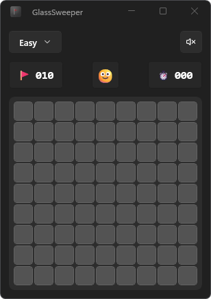

# GlassSweeper

A native **Windows** take on Minesweeper, built with **WinUI 3** and a translucent Mica/glass aesthetic. It's the Windows sibling of [SwiftSweeper](https://github.com/BenjaminHolderbein/swiftsweeper) (macOS/SwiftUI) — the game logic is a faithful C# port of that project's `SwiftSweeperKit`.

<p align="center">
  
</p>

## Features

- Classic Minesweeper with **first-click safety** (your first tap is always a safe opening — the clicked cell and its 8 neighbors are mine-free).
- **Chording**: left-click a revealed number whose adjacent flag count matches its value (or middle-click) to clear the remaining neighbors.
- Right-click cycles a cell through **flag → question mark → clear**.
- Difficulty presets — Easy (9×9, 10), Medium (13×13, 25), Hard (16×16, 45) — plus a **Custom** board (5–30 per side).
- Live mine counter and timer, win/loss overlay, and auto-flagging of remaining mines on a win.
- Native **Mica backdrop**, Fluent styling, and a board that scales crisply to any window size and DPI.

## Controls

| Action | Input |
| --- | --- |
| Reveal a cell | Left-click |
| Flag / question / clear | Right-click |
| Chord (reveal neighbors) | Left-click a satisfied number, or middle-click |
| New game | Click the face button, or "Play again" |

## Install

GlassSweeper ships as a signed, self-contained **MSIX** package. Once installed it
behaves like any other Windows app — it lives in the **Start menu** with its icon,
launches with a click, and uninstalls from **Settings → Apps** the normal way. The
.NET and Windows App SDK runtimes are bundled, so there's nothing else to install.

1. **Get the package.** Build it with the steps in [PACKAGING.md](PACKAGING.md) (or,
   if a prebuilt [release](https://github.com/BenjaminHolderbein/GlassSweeper/releases)
   is available, download its package folder). Either way you end up with a folder
   containing the `.msix`, a `.cer` certificate, and `Install.ps1`.
2. **Install.** In that folder, open an **elevated** PowerShell and run:
   ```powershell
   powershell -ExecutionPolicy Bypass -File .\Install.ps1
   ```
   This trusts the bundled (self-signed) certificate once, then installs the app.
3. **Play.** Launch **GlassSweeper** from the Start menu. To remove it later,
   right-click it in Start → Uninstall, or use **Settings → Apps → Installed apps**.

> Requires Windows 10 1809 (build 17763) or later. No prerequisites — the runtimes
> are bundled in the package.

## Project structure

| Project | Purpose |
| --- | --- |
| `GlassSweeper.Core` | Pure, UI-independent game logic (`Cell`, `GameViewModel`). No WinUI dependency — fully unit-testable. |
| `GlassSweeper.App` | WinUI 3 (Windows App SDK) packaged desktop app — board rendering, HUD, input, MVVM presentation layer. |
| `GlassSweeper.Tests` | xUnit suite (20 tests) covering board generation, reveal cascade, flagging, chording, win/loss, and custom-board clamping. |

## Build & run from source

For development you'll need:

- Windows 10 1809 (build 17763) or later
- [.NET 9 SDK](https://dotnet.microsoft.com/download) with the Windows App SDK workload (or Visual Studio 2022 with the **Windows App SDK C# Templates** component)
- **Developer Mode** enabled to run a locally-built (unsigned) packaged app

```powershell
# Restore & build
dotnet build GlassSweeper.sln -c Debug

# Run the app (unpackaged, fastest for iteration)
dotnet run --project GlassSweeper.App --launch-profile "GlassSweeper.App (Unpackaged)"

# Run as the packaged MSIX app (deploys with package identity)
dotnet run --project GlassSweeper.App --launch-profile "GlassSweeper.App (Package)"

# Run the tests
dotnet test
```

To produce the installable signed MSIX, see [PACKAGING.md](PACKAGING.md).

## Tech stack

- C# / .NET 9
- WinUI 3 — Windows App SDK 2.2
- CommunityToolkit.Mvvm
- xUnit

## Credits

Game logic ported from [SwiftSweeper](https://github.com/BenjaminHolderbein/swiftsweeper) by Benjamin Holderbein.
